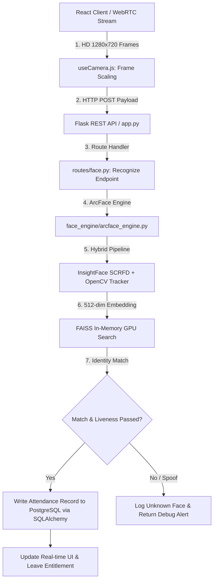

# Visiora — AI Organizational Suite (v6.0)

[](https://www.python.org/)
[](https://react.dev/)
[](https://flask.palletsprojects.com/)
[](https://www.postgresql.org/)
[](https://github.com/deepinsight/insightface)
[](LICENSE)

**Visiora** is a state-of-the-art, production-grade **AI-Powered Organizational & Workforce Operations Suite**. It combines real-time computer vision biometric attendance, automated leave management with draft support, departmental cover workflows, and role-based administrative intelligence into a unified, high-performance web platform.

---

## 🌟 Key Features & Capabilities

### 📸 1. AI Vision & Biometric Attendance Engine
* **InsightFace ArcFace Integration:** Generates 512-dimensional normalized face embeddings (`buffalo_l` / `w600k_r50` model).
* **FAISS Vector Search:** In-memory similarity search ($<0.1\text{ ms}$ query latency) with GPU CUDA acceleration.
* **Hybrid SCRFD Detection & Tracking:** Detects faces periodically and tracks intermediate frames with OpenCV CSRT/KCF to optimize CPU/GPU utilization.
* **Anti-Spoofing & Quality Checks:** Eye Aspect Ratio (EAR) blink tracking, Laplacian blur variance filtering, and anti-spoofing validation.
* **Vector Database Persistence:** Embeddings stored in **PostgreSQL** using the **`pgvector`** extension.

### 📝 2. Smart Leave Management System
* **Multiple Leave Types:** Casual, Medical, and Festival leaves.
* **Save-as-Draft Workflow:** Draft leave requests privately before formal submission without affecting annual quotas.
* **Departmental Alternative Cover Prioritization:** Prioritizes active colleagues from the applicant's department (`Same Dept`) for duty coverage.
* **Admin & HR Review Queue:** Comprehensive review queue with Approve/Reject modal dialogs and review comments.
* **Dynamic Applicant Summary Inspection:** Clicking any applicant's card in review mode dynamically inspects their yearly entitlement, leave taken, pending requests, remaining balance, and last leave date in the right panel.
* **Auto Quota Calculation:** Fixed 25-day annual entitlement with automated real-time quota deduction upon approval.

### 🏢 3. Enterprise Access Control & Management
* **Role-Based Access Control (RBAC):** Granular permissions for `admin`, `hr`, `user`, and `student` roles.
* **Department & Session Scheduling:** Flexible class/work session timing and department categorization.
* **Profile Change Requests:** User profile update requests requiring administrative approval.
* **Unknown Face Alerting:** Automated logging and visual audit of unidentified face detections.

---

## 🛠️ System Architecture



---

## 💻 Tech Stack

| Layer | Technology |
| :--- | :--- |
| **Frontend Framework** | React 18, Vite, React Router v6, Axios |
| **Styling & Icons** | Custom Glassmorphism CSS Design Tokens, Lucide React |
| **Backend Framework** | Python 3.10, Flask REST API, Flask-JWT-Extended |
| **Database & ORM** | PostgreSQL 15+, `pgvector` Extension, SQLAlchemy ORM |
| **AI / Machine Learning** | InsightFace ArcFace (`buffalo_l`), ONNX Runtime CUDA, PyTorch |
| **Vector Indexing** | FAISS (Facebook AI Similarity Search) |
| **Biometrics** | Futronic Fingerprint SDK (Optional Integration) |

---

## ⚙️ Initial Setup & Installation

### 1. Prerequisites
* **Python:** 3.10 recommended
* **Node.js:** v18+
* **Database:** PostgreSQL 15+ with `pgvector` extension installed
* **Hardware:** Webcam + optional NVIDIA GPU (CUDA runtime)

### 2. Database Preparation
```bash
createdb attendance_db
psql -d attendance_db -c "CREATE EXTENSION vector;"
```

### 3. Backend Setup
```bash
cd backend
python -m venv venv
venv\Scripts\activate
pip install -r requirements.txt
```

### 4. Frontend Setup
```bash
cd frontend
npm install
npm run build
```

---

## 🚀 Running the Application

Launch both backend API and frontend development server with the integrated launcher:

```bash
run.bat
# OR
python launcher.py
```

* **Frontend Client:** `http://localhost:5173`
* **Backend REST API:** `http://localhost:5000`

---

## 📄 License
Distributed under the **MIT License**. See `LICENSE` for more information.
